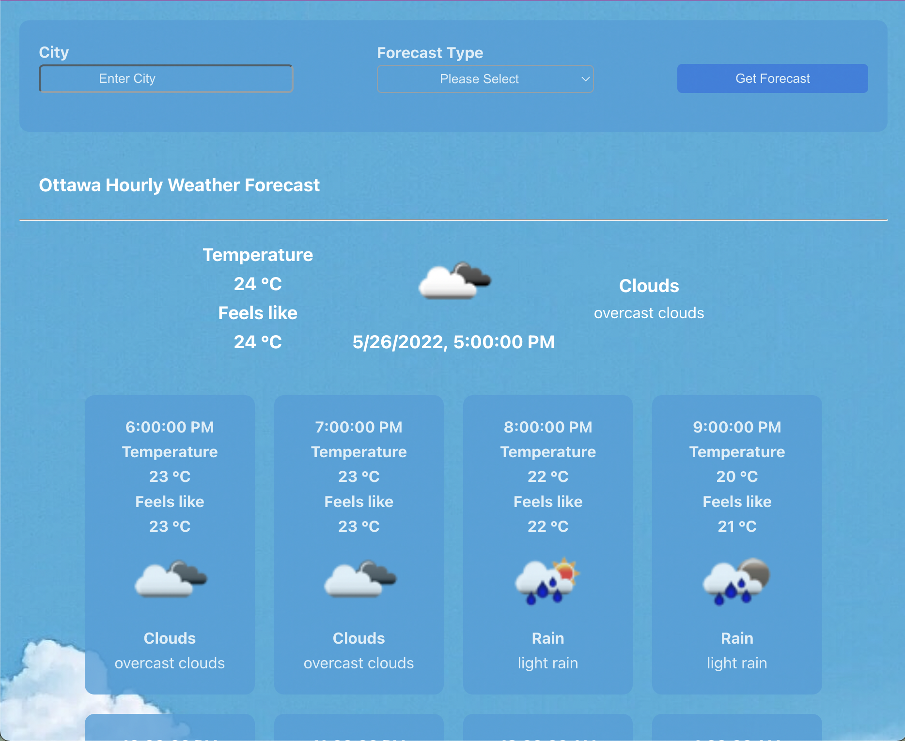
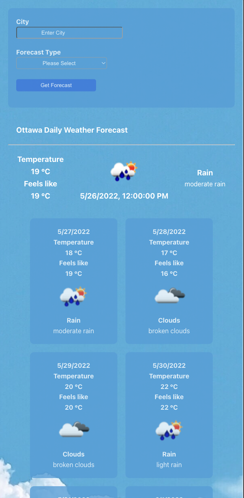

# React Weather Forecast App

This app has been deployed [here](https://react-weatherforecast-app.herokuapp.com/).

- Front-end stack: ReactJS, SASS
- Back-end stack: Express
- API: OpenWeatherMap Weather API

Desktop view

Mobile view

## `npm install`

In the project directory, you can run: `npm install` to install the app.

### `npm start`

Runs the app in the development mode.\
Open [http://localhost:3000](http://localhost:3000) to view it in your browser.

### Functionalities

- A user should be able to specify the name of a city through the input field and the type of weather forecast (hourly or daily) through the drop down menu they want.
- Based on the type of weather forecast selected, a user should see snippets of corresponding weather forecast rendered below the input fields.
- The app is responsive to a user's screensize.
